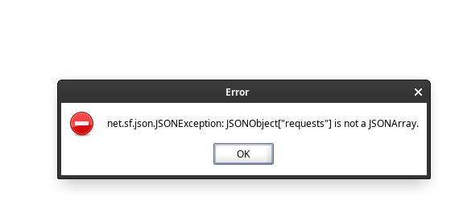

# postmanSoapUIConverter

This script aims to convert postman collection json files to a soap project xml file. It originated from my frustration with SoapUI's limited support for importing Postman collections. SoapUI's decision to only support v1 collections without adapting to newer versions of Postman collections (v2, v2.1) seems outdated and inconvenient for me at least.

If you try to import v2 and above postman collections


## Executing the script

Ensure you have Node.js installed on your machine. To run the script, download the main.js file, navigate to your downloads directory and execute the following command in your shell:

```bash
node main.js /full/path/to/input_collection.json /full/path/to/output_soap_project.xml
```

## Stuff I didn't bother adding

- js to groovy pre request script conversion
- any authentication method conversion

## Why not?

It just werks for me and serves my purpose. If you want any features feel free to add it yourself.
